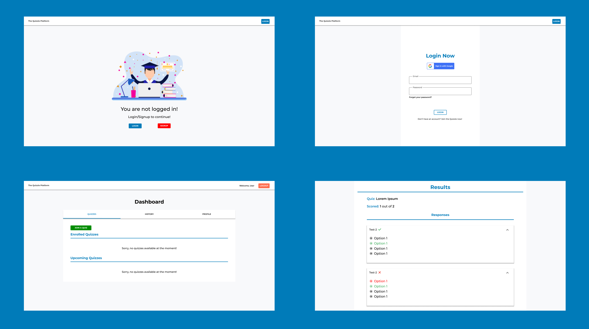

# Quizzie

This project is a complete online quiz management platform with a plethora of features for teachers and students. It provides all the basic functionalities of a quiz portal like timer, scoring, ranking etc. alongside analysis of results from the students on the teacher dashboard, summary of tests for the student, Login and signup using a Google account for both teacher and student. It provides a smooth user interface for both the teachers and students to create and attempt different kinds of quizzes seamlessly. 

---
[](https://documenter.getpostman.com/view/10968840/SzzoZF12)


## Motivation
  The motivation of this project came from the idea to help teachers and institute administrators create quizzes and tests in an efficient manner. With the popularity of the Internet, it is inevitable to have online quizzes as classroom assessments. In learning, online quizzes may serve two objectives, that is, for self-study or as a formal assessment. The online quiz has its advantages, such as saving the cost of paper printing and reducing the time spent for having assessments in class. However, there are weaknesses. Its primary drawback is the issue of academic dishonesty, especially when students are answering online quiz.

## Screenshots


## Features
- Stats view for detailed examination
- Secure and foolproof
- Users can signup/sign in using Google to make the flow easier
- Detailed ananlysis of quiz for both organizers and users


## Techstack
- The website is developed using MERN stack. (Mongo Express React Node)
- Frontend uses React


## Instructions to run

```
$ git clone https://github.com/Quizzie-SE/quizzie-se-frontend
$ cd quizzie
$ npm install
$ npm run dev
```

## Contributors
<table>
<tr align="center">


<td>

Jugal Bhatt

<p align="center">

</p>
<p align="center">
<a href = "https://github.com/jugaldb"></a>
<a href = "https://www.linkedin.com/in/jugal-bhatt14/">

</a>
</p>
</td>
<td>

Dinesh B S

<p align="center">

</p>
<p align="center">
<a href = "https://github.com/DineshBS44"></a>
<a href = "https://www.linkedin.com/in/dinesh-b-s-197983192/">

</a>
</p>
</td>


</tr>
  </table>

## License

[](http://badges.mit-license.org)


